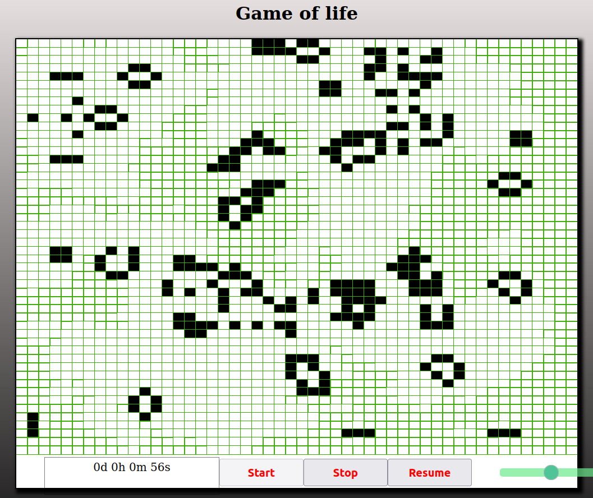

# Game_of_life
A simplified tool to visualise the famous game "game of life". Build using HTML, CSS and JavaScript.

The game is a cellular automaton devised by the British mathematician John Horton Conway in 1970. It is a zero-player game, meaning that its evolution is determined by its initial state,and  requiring no further input.
<a href="https://en.wikipedia.org/wiki/Conway%27s_Game_of_Life">Read more</a>

you can try it  online <a href="https://game-of-life-deployment.vercel.app/">here</a>

  

